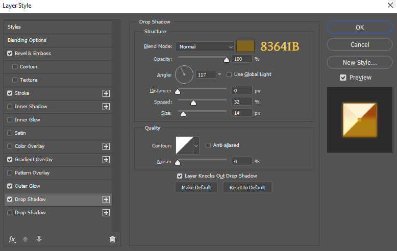

### YayoiKusanagi

1. Для текста из вступительного ролика (папка 125000), использовал шрифт "Trump Gothic Pro - Medium Italic", цвет - ffffff, размер 24, стиль - Sharp. Так же был использован стиль слоя Stroke (обводка), размер 2, цвет - 1b1b1b. И стиль "Drop Shadow" (тень), для приближения к оригиналу. Размер текстуры: 1024 x 128

[PSD.psd](../presets/PSD.psd)

2. Для надписей "Quest Completed" и прочих (папки 120000 и 121000), используется шрифт "Jupiter Pro Bold", у которого все буквы заглавные. По сути стиль напоминает стилизацию логотипа "Властелин колец". Я использовал цвет - fdc93f, размер заглавных букв - 61.5, прописных - 52. Используется большое количество стилей слоя, а так же в качестве фона надписи отдельный слой, с полупрозрачным пятном, имитирующем дополнительное свечение. На прикреплённом примере мой вариант в центре (верхний и нижний стандартный, для сравнения).

2.1. Cтили.

2.2. Информация про заглавные буквы (после дописать про это).

 [Quest_Accepted.psd](../presets/Quest_Accepted.psd) 

### EnderVAD

Форматы DDS-текстур:

* SD (без `_hr1`) - B8G8R8A8_UNORM, 1 mips - в Paint.NET это **B8G8R8A8 (Linear, A8R8G8B8)**

* HD (с `_hr1`) - BC3_UNORM, 1 mips - в Paint.NET это **BC3 (Linear, DXT5)**

В обоих случаях не генерировать mipmaps.

### YayoiKusanagi

ВС3 кажется даже в фотошопе есть, через плагин Nvidia, но это надо будет протестировать.

### EnderVAD

Как я ночью познал, в разных местах эти компрессии по-разному называют, там чёрт ногу сломит. Я в итоге сверял в вот этой программе:

https://renderdoc.org/

Закидываешь текстуру, и под её предпросмотром будет указан формат, количество мипмапов (должен быть 1) и прочая ерунда. Могу скинуть оригинальные DDS, если нужно.

А если в Фотошопе можно посмотреть на формат открытой DDS, то я лох и не нашёл.

### YayoiKusanagi

У меня фотошоп знатно виснет при сохранении DDS, да и через Паинт чохранять поштучно будет утомительно. Поэтому я пока что буду делать всё в PNG, а в дальнейшем может найдём фост, который позволит массово конвертировать один формат в другой.

>EnderVAD: А если в Фотошопе можно посмотреть на формат открытой DDS, то я лох и не нашёл.

Не, нету в фотошопе функции, анализа типа текстуры. Вернее она есть, но там всё пусто. Так что твой способ пока единственный удобный и рабочий.